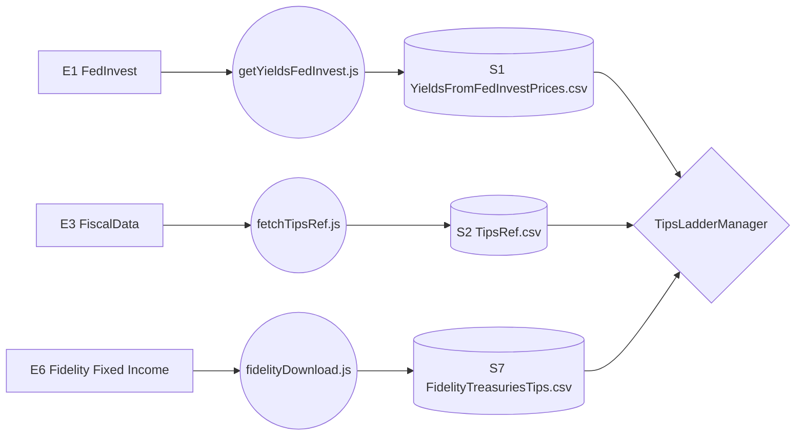

# 3.1 Data Pipeline (TIPS Logic)

## Dependencies
**Requires:** [TIPS Basics](../../knowledge/TIPS_Basics.md)

---

## 1.0 Data Context (DFD)

This diagram shows the flow of TIPS-specific metadata and price data.

---

## 2.0 Ingestion Processes

### [getYieldsFedInvest.js](../../scripts/getYieldsFedInvest.js)
FedInvest price ingestion — the cross-check source (see §4.0).
- **Frequency**: Daily (Weekdays ~1 PM ET).
- **Logic**: Scrapes the FedInvest daily price table for all TIPS. Cross-references with `TipsRef.csv` to calculate YTM (Excel YIELD convention).
- **Output**: `YieldsFromFedInvestPrices.csv`.

### [fetchTipsRef.js](../../scripts/fetchTipsRef.js)
Fetches immutable TIPS metadata from the FiscalData API.
- **Frequency**: Weekly (or on-demand for new issuances).
- **Logic**: Queries the `auctions_query` endpoint for TIPS with "Original" issuance type.
- **Output**: `TipsRef.csv` (contains Coupon, Dated Date, and Dated date Ref CPI).

### [fidelityDownload.js](../../../YieldCurves/scripts/fidelityDownload.js)
Broker price and yield ingestion — the default source (see §4.0). Shared with YieldCurves (owns the task).
- **Frequency**: 3× weekdays (Windows Task Scheduler task `FidelityQuotes`).
- **Logic**: Playwright-driven download of the broker's secondary-market Treasury and TIPS offerings, uploaded to R2.
- **Output**: `FidelityTreasuriesTips.csv` (combined Treasury+TIPS; TipsLadderManager uses TIPS rows' ask price, recomputing yield from it rather than trusting the file's own quoted yield column — see §4.0).

---

## 3.0 Data Elements
*Refer to the [DATA_DICTIONARY.md](../../knowledge/DATA_DICTIONARY.md) for full definitions.*

- **[Yield](../../knowledge/DATA_DICTIONARY.md#yield)**: The yield-to-maturity (YTM) used for ladder discounting.
- **[Dated date Ref CPI](../../knowledge/DATA_DICTIONARY.md#ref-cpi)**: The reference CPI on the bond's dated date, used for [Index Ratio](../../knowledge/DATA_DICTIONARY.md#index-ratio) calculations. Sourced from `TipsRef.csv` regardless of yield source — `FidelityTreasuriesTips.csv` doesn't carry it.

---

## 4.0 Yield Sources

TipsLadderManager sources price and yield from the broker quotes by default — the underlying source is never named in the UI (not advertising where the data is scraped from). Instead the info strip (`#info-source`) shows the dates that matter: `Trade: MM/DD/YYYY · Settle: MM/DD/YYYY` (Trade = the data's as-of/"today" date, Settle = T+1; 6.0 §Info Strip, 3.0 §Ref CPI Date). The Ref CPI date is not shown or settable in either mode: it is the settlement date, already named beside it. `shared/src/market-data.js`'s `fetchFidelityTipsData()` and `fetchTipsData()` (FedInvest) both return the same `yieldsRows` shape (`{ settlementDate, cusip, maturity, coupon, baseCpi, price, yield }`) so downstream ladder math (`buildTipsMapFromYields`, `ladder-core.js`) is source-agnostic.

**Anything that computes ladder numbers outside the app must load through `market-data.js`, not re-read a CSV.** `YIELD_SOURCE` is private to that module, so a script that opens `YieldsFromFedInvestPrices.csv` directly gets the dormant source's prices while the app is using Fidelity's, and every figure it produces is quietly wrong. Ad-hoc analysis scripts are covered by this: their conclusions are the reason they exist. Call `fetchFidelityTipsData()` (shimming `fetch` to serve local copies if offline) rather than parsing the file, so the source can never diverge from the app's.

FedInvest is **not exposed to users at all** — no UI control selects it. It's kept as a dormant cross-check path (matches [tipsladder.com](https://tipsladder.com), which uses FedInvest): flip the `YIELD_SOURCE` constant in `shared/src/market-data.js` to `'fedinvest'` to re-enable it for local/dev cross-checking. This is now the single decision point for every consumer of the module (TipsLadderManager and TipsReference alike) — a flip cannot strand one app on the dormant source while another moved on. (An earlier version of this feature exposed both sources via a dropdown in Row 1 — removed 2026-07-24: the input card was already crowded, especially in Build mode, and a rarely-used cross-check path didn't warrant a permanent slot. If it's reinstated, keep it subtle rather than a prominent dropdown.)

**FedInvest also serves the historical end.** It is the only source with per-CUSIP prices for a past
date, which is what makes a realistic year-over-year test possible: build a ladder in the world as it
stood a year ago, export it, then load that export against today's data. `scripts/getFedInvestPricesForDate.js`
writes a `YieldsFromFedInvestPrices.csv` for any past trading day in the format `market-data.js` parses.
TreasuryDirect guards these endpoints with a CSRF token and has renamed their fields more than once
(the month/day/year triple is now a single ISO `priceDate`), so the script parses the live form and
submits exactly what it declares rather than hardcoding names — the same discipline
`getYieldsFedInvest.js` adopted for the daily endpoint. A non-trading day still renders a "Prices
For:" page with an empty table, so the script requires actual rows and checks the page echoes the
date asked for before writing anything.
**One entry point: `loadMarketData()` (`shared/src/market-data.js`).** `YIELD_SOURCE` is private to that module and every consumer goes through the function, so no caller picks a source — there is no choice left to get wrong. It returns the raw rows plus the three dates whose derivation is source-dependent (`settleDateStr`, `tradeDateStr`, `defaultRefCpiDateStr`), because that derivation is exactly what a caller reproducing the load by hand gets wrong: FedInvest's settlement date is T and doubles as the trade date, Fidelity's is already T+1 and its trade reference is the download date. Callers still build the TIPS map themselves (`buildTipsMapFromYields`, `rebalance-lib.js`) — `market-data.js` is a leaf and must not import an orchestrator (4.0 §Module Dependency Graph). Moved here from `TipsLadderManager/src/data.js` so other apps can share it without duplicating the source decision — TipsReference is a consumer too (see `TipsReference/knowledge/1.0_TIPS_Reference.md`).

This replaced a constant sitting in `index.html`. Anything outside the app that wanted market data had to re-implement the load, and re-implementing it meant choosing a source; the obvious in-repo template (`tests/run.js`) reads the FedInvest fixture, so the wrong choice was the easy one. An analysis harness built that way priced a whole investigation off the dormant source before the mismatch surfaced (2026-08-26).

| | **Market quotes, default** | **FedInvest, dormant** |
|---|---|---|
| Price | the broker's own quoted ask price | TreasuryDirect midpoint (bid+ask)/2 |
| Yield | Computed from ask price via `yieldFromPrice()` (`shared/src/bond-math.js`) | Computed from price via the same `yieldFromPrice()` |
| Settlement date | T+1 from the quote download date (real broker trade settlement) | T (the FedInvest file's own reference date — required for its price↔yield pairing to stay internally consistent; see below) |
| Use case | Default — reflects what you'd actually pay/earn placing a real order | Cross-checking against tipsladder.com |

**Why yield is computed from price rather than read from the broker's own quoted yield column:** verified empirically (2026-07) that `yieldFromPrice()` produces a more accurate yield than Fidelity's own quoted ask-yield-to-maturity field for TIPS. Matches the convention YieldCurves already uses for TIPS (`buildProcessedTipsBonds` in `YieldCurves/src/app.js`).

**Settlement date conventions — do not conflate:** `settlementDate` (drives yield/duration/index-ratio math, source-dependent as above) is a *different concept* from the Trade Ticket's accrued-interest settlement date, which is always the forward T+1 trading day from today regardless of which yield source is active (`ttSettlementDate` in `index.html`, see 5.0 §Trade Ticket). FedInvest's own settlement date is T, not T+1, specifically because that's the reference point its own price→yield computation was performed against — using T+1 there would desynchronize FedInvest's price and yield. Conflating the two settlement dates caused a real accrued-interest bug (fixed 2026-07-24, see 5.0 §Trade Ticket) and must not recur when extending either source.

**Bond-calendar primitives live in `shared/src/settlement.js`, not here.** `nextBondTradingDay(isoDateStr, holidaySet)` (`market-data.js`, a thin ISO-string wrapper) and `actualPaymentDate(d, holidaySet)` both build on `settlement.js`'s `nextBusinessDay`/`parseHolidaySet` — the single implementation of weekend/SIFMA-holiday skipping, also used by YieldsMonitor, SeasonalAdjustments, and YieldCurves. The two are not interchangeable: `nextBusinessDay` always advances at least one day; `actualPaymentDate` is "on or after" — it returns the date unchanged when that date is already a trading day, and only rolls forward when it isn't. Every coupon/principal payment date, the Cash Flow Calendar (5.0 §Cash Flow Calendar), and settlement-year LMI (2.0 §Settlement-Year Coupon Treatment) depend on `actualPaymentDate`'s on-or-after guard specifically; implementing it as a plain call to `nextBusinessDay` silently shifts every on-time payment forward by one business day.

## 5.0 E2E Test Fixtures

`tests/e2e/app.spec.js`'s `beforeEach` mocks **every** R2 fetch `market-data.js` makes via `page.route()`,
fulfilling each with a local fixture file (`tests/e2e/*.csv`) instead of letting the request reach
the real R2 endpoint: `YieldsFromFedInvestPrices.csv`, `FidelityTreasuriesTips.csv`, `RefCPI.csv`,
`TipsRef.csv`, `YieldsSaSao.csv`, `BondHolidaysSifma.csv`.

**Why every single one, not just the obvious ones:** the E2E test browser has **no live network
egress** in a sandboxed session (this is a well-known, by-design property of that kind of sandbox,
not flakiness or an outage) — `curl` from the same machine can reach R2 fine, but a real browser
(any browser, not a specific tool) cannot. An unmocked R2 URL doesn't fail gracefully; the app's own
`fetchAuxTipsData()`/`fetchTipsData()`/`fetchFidelityTipsData()` `Promise.all` rejects with a plain
"Failed to fetch", which surfaces as "Failed to load market data: Failed to fetch" in the UI — and
since the `beforeEach` itself waits on `#run-btn` becoming enabled, **every single test in the file
times out**, not just the ones that exercise the new field. This is easy to misdiagnose as a
transient R2 outage or an environment/CORS issue (both were seriously investigated and ruled out
before finding the real cause: a missing mock) rather than "I added a fetch and forgot the fixture."

**Rule: any new required fetch added to `shared/src/market-data.js` needs two things added here, not just the
fetch itself:**
1. A local fixture file in `tests/e2e/` with realistic data — for a per-CUSIP file, covering (at
   least) every CUSIP already in `tests/e2e/YieldsFromFedInvestPrices.csv`, so joins don't silently
   produce nulls for the bonds the other fixtures actually exercise.
2. A matching `page.route('**/<R2 path>', r => r.fulfill({ body: csv('<fixture>.csv'), contentType: 'text/csv' }))` line in `app.spec.js`'s `beforeEach`, alongside the existing ones.

Skipping either one doesn't fail loudly and specifically — it fails as a wall of unrelated-looking
timeouts across the whole suite, which is why this is worth checking first whenever a from-scratch
E2E run suddenly goes from all-green to all-red after adding a new data source.

**Testing a work-in-progress branch/worktree in isolation:** `playwright.config.js` defaults to
`reuseExistingServer: true` on port 8080 — if a persistent dev server from a *different* checkout
(e.g. `main`, or another worktree) is already bound to that port, Playwright silently reuses it
instead of serving this checkout's code, and the whole suite can report a misleading "all green"
against the wrong code. Check what's actually being served (`curl` a string unique to your recent
change, e.g. `curl http://localhost:8080/... | grep <your change>`) before trusting a green run when
working in a worktree or branch other than whatever's normally on 8080.
