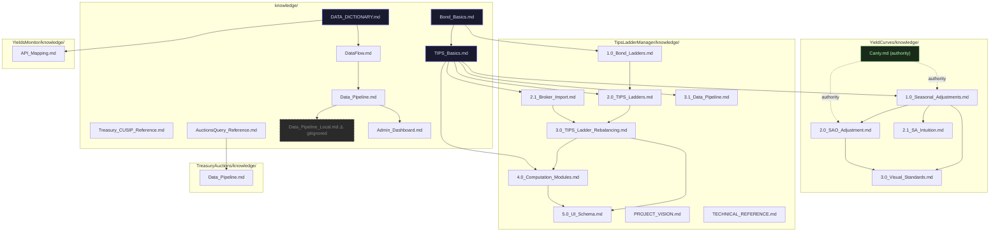

# Knowledge Map

Dependency graph of all knowledge files. Arrows flow from foundation → dependent.
Subgraphs show file location. Dashed arrows = authority reference (not a hard dependency).

```mermaid
flowchart TD
    subgraph Root["knowledge/"]
        DD["DATA_DICTIONARY.md"]
        BondBasics["Bond_Basics.md"]
        TIPSBasics["TIPS_Basics.md"]
        CUSIPRef["Treasury_CUSIP_Reference.md"]
        AuctQRef["AuctionsQuery_Reference.md"]
        DataFlow["DataFlow.md"]
        DataPipeline["Data_Pipeline.md"]
        DataPipelineLocal["Data_Pipeline_Local.md ⚠️ gitignored"]
        AdminDash["Admin_Dashboard.md"]
    end

    subgraph YC["YieldCurves/knowledge/"]
        YC10["1.0_Seasonal_Adjustments.md"]
        YC20["2.0_SAO_Adjustment.md"]
        YC21["2.1_SA_Intuition.md"]
        YC30["3.0_Visual_Standards.md"]
        Canty["Canty.md (authority)"]
    end

    subgraph TLM["TipsLadderManager/knowledge/"]
        TLM10["1.0_Bond_Ladders.md"]
        TLM20["2.0_TIPS_Ladders.md"]
        TLM21["2.1_Broker_Import.md"]
        TLM30["3.0_TIPS_Ladder_Rebalancing.md"]
        TLM31["3.1_Data_Pipeline.md"]
        TLM40["4.0_Computation_Modules.md"]
        TLM50["5.0_UI_Schema.md"]
        TLMPV["PROJECT_VISION.md"]
        TLMTR["TECHNICAL_REFERENCE.md"]
    end

    subgraph TA["TreasuryAuctions/knowledge/"]
        TADP["Data_Pipeline.md"]
    end

    subgraph YM["YieldsMonitor/knowledge/"]
        YMAPI["API_Mapping.md"]
    end

    %% Root chain
    DD --> DataFlow --> DataPipeline --> AdminDash
    DataPipeline --> DataPipelineLocal

    %% Basics chain
    BondBasics --> TIPSBasics

    %% YieldCurves
    TIPSBasics --> YC10
    YC10 --> YC20
    YC10 --> YC21
    YC10 --> YC30
    YC20 --> YC30
    Canty -.->|authority| YC10
    Canty -.->|authority| YC20

    %% TipsLadderManager
    BondBasics --> TLM10
    TLM10 --> TLM20
    TIPSBasics --> TLM20
    TIPSBasics --> TLM21
    TLM20 --> TLM30
    TLM21 --> TLM30
    TIPSBasics --> TLM31
    TLM30 --> TLM40
    TIPSBasics --> TLM40
    TLM30 --> TLM50
    TLM40 --> TLM50

    %% TreasuryAuctions
    AuctQRef --> TADP

    %% YieldsMonitor
    DD --> YMAPI

    %% Styling
    classDef foundation fill:#1a1a2e,color:#e0e0ff,stroke:#4444aa,stroke-width:2px
    classDef gitignored fill:#2a2a2a,color:#888,stroke:#555,stroke-dasharray:5 5
    classDef authority fill:#1a2a1a,color:#aaffaa,stroke:#44aa44,stroke-width:1px

    class DD,BondBasics,TIPSBasics foundation
    class DataPipelineLocal gitignored
    class Canty authority
```
