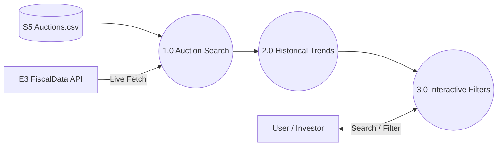

# TreasuryAuctions (App Overview)

**TreasuryAuctions** is a tool for monitoring and analyzing U.S. Treasury auction results (Bills, Notes, Bonds, and TIPS). It provides historical data and real-time updates on upcoming issuances.

---

## 1.0 App Context (Level 1 DFD)

---

## 2.0 Core Processes

### [1.0 Auction Search](../TreasuryAuctions/knowledge/Data_Pipeline.md)
Retrieves auction results from both the local `Auctions.csv` database and the live FiscalData API.
- **Goal**: Enable exploration of historical auction performance (e.g., high yields, bid-to-cover ratios).
- **Sources**: FiscalData (accounting/od/auctions_query).

---

## 3.0 Foundational Logic (The Engine Room)

- **[Auctions Query Reference](../../knowledge/AuctionsQuery_Reference.md)**: Technical guide to the FiscalData API fields and query logic.
- **[Data Pipeline](../../knowledge/Data_Pipeline.md)**: Details on the local **Auction Refresh** job that maintains the historical database.
