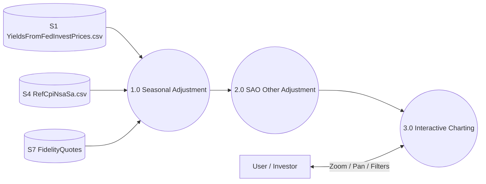

# YieldCurves (App Overview)

**YieldCurves** analyzes TIPS (Treasury Inflation-Protected Securities) real yields under two adjustments: seasonal, and other. It produces a fair-value curve by removing the predictable seasonal component of CPI and then the remaining non-seasonal deviations from a smooth curve.

---

## 1.0 App Context (Level 1 DFD)

---

## 2.0 Core Processes

### [1.0 Seasonal Adjustment (SA)](../YieldCurves/knowledge/3.2_Seasonal_Adjustments.md)
Normalizes real yields by applying seasonal factors derived from BLS CPI-U (NSA vs SA) data.
- **Goal**: Enable "fair" comparison of yields across different months of the year.
- **Formula**: `SA Yield = Clean Price * (S_settle / S_maturity)`

### [2.0 SAO Other Adjustment](../YieldCurves/knowledge/3.3_SAO_Adjustment.md)
Applies a backwards-anchored linear regression to smooth the front-end of the SA curve.
- **Goal**: Remove idiosyncratic "wiggles" caused by liquidity or one-off shocks to specific CUSIPs.
- **Method**: Blending the SA yield with a projected trend line.

### [3.0 Interactive Visualization](../YieldCurves/knowledge/Visual_Standards.md)
A high-performance charting interface built with Chart.js and Hammer.js.
- **Features**: Full X/Y zoom, vertical panning, and dataset visibility toggles.
- **Visual Priority**: SAO > SA > Ask (Market).

---

## 3.0 Foundational Logic (The Engine Room)

- **[SA Intuition (2.1)](../YieldCurves/knowledge/SA_Intuition.md)**: Conceptual guide to why seasonality matters for TIPS.
- **[Canty Authority](../YieldCurves/knowledge/Canty.md)**: Technical reference for the mathematical foundations of SA/SAO (Canty, 2009).
- **[Data Pipeline](./Data_Pipeline.md)**: Details on the GitHub Actions that update the R2 data stores.
