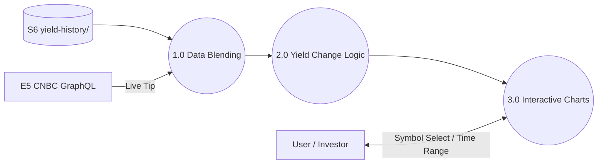

# YieldsMonitor (App Overview)

**YieldsMonitor** is a real-time and historical visualization tool for U.S. Treasury yields (Nominal and TIPS). It provides high-resolution intraday tracking and long-term trend analysis, focusing on consistency and market-state awareness.

---

## 1.0 App Context (Level 1 DFD)

---

## 2.0 Core Processes

### [1.0 Data Blending (The "Live Tip")](../YieldsMonitor/knowledge/1.0_Operation.md#data-blending-live-tip)
Combines historical daily closes from R2 with real-time high-resolution feeds from CNBC.
- **Goal**: Ensure the "Latest Yield" is always up-to-the-second regardless of the historical chart range.
- **Method**: Appending the 5D CNBC feed to the R2 JSON baseline.

### [2.0 Yield Change Logic](../YieldsMonitor/knowledge/1.0_Operation.md#yield-change-calculation)
Calculates the difference between the latest yield and the previous market close (17:00 ET).
- **Goal**: Provide a consistent "Day Change" metric across all views.
- **Timezone**: All logic is anchored to `America/New_York` wall-clock time.

### [3.0 Interactive Visualization](../YieldsMonitor/knowledge/1.0_Operation.md#uiux-standards)
Intraday and historical charts featuring market-state annotations.
- **Features**: After-hours and weekend shading, Y-axis auto-rescaling, and comparative yield curve overlays.
- **Precision**: Yields are tracked to 3 decimal places for granular movement analysis.

---

## 3.0 Foundational Logic (The Engine Room)

- **[Operation Manual (1.0)](../YieldsMonitor/knowledge/1.0_Operation.md)**: Exhaustive details on timezone handling, shading colors, and API fallback logic.
- **[API Mapping](../YieldsMonitor/knowledge/API_Mapping.md)**: Technical mapping of CNBC symbols and R2 file paths.
- **[Data Pipeline](../../knowledge/Data_Pipeline.md)**: Details on the local **Yield History Snap** job that snapshots daily closes.
