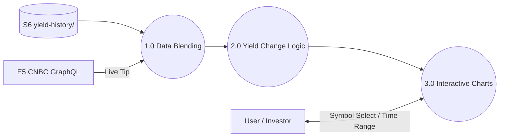

# YieldsMonitor (App Overview)

**YieldsMonitor** is a real-time and historical visualization tool for U.S. Treasury yields (Nominal and TIPS). It provides high-resolution intraday tracking and long-term trend analysis, focusing on consistency and market-state awareness.

---

## 1.0 App Context (Level 1 DFD)

---

## 2.0 Core Processes

### [1.0 Data Blending](../YieldsMonitor/knowledge/1.0_Operation.md#data-architecture)
For 1Y+ ranges: blend R2 historical baseline with latest intraday yields from CNBC for current market context.
- **Goal**: Ensure "Latest Yield" and "Day Change" always reflect current trading, not stale historical closes.
- **Method**: 1Y+ fetch R2 historical baseline (daily closes, updated by snapHistory.js), then append latest intraday yields from CNBC 5D feed.

### [2.0 Yield Change Logic](../YieldsMonitor/knowledge/1.0_Operation.md#yield-change-calculation)
Calculates the difference between the latest yield and the previous market close (17:00 ET).
- **Goal**: Provide a consistent "Day Change" metric across all views.
- **Timezone**: All logic is anchored to `America/New_York` wall-clock time.
- **Reference point**: The last bar at exactly **17:00 ET** on the previous trading day. This is the official end-of-trading-day close.
- **Deviation from CNBC**: CNBC's displayed yield change uses an earlier reference (their `previous_day_closing` field from the Tradeweb quote service), which appears to reflect a **mid-afternoon settlement quote** (~3:00 PM ET) rather than the 5 PM close. On 2026-04-08 for US1Y, our 17:00 close = 3.693% vs. CNBC's reference = 3.685% — a 0.008% discrepancy. This is expected and intentional.

### [3.0 Interactive Visualization](../YieldsMonitor/knowledge/1.0_Operation.md#uiux-standards)
Intraday and historical charts featuring market-state annotations.
- **Features**: After-hours and weekend shading, Y-axis auto-rescaling, and comparative yield curve overlays.
- **Precision**: Yields are tracked to 3 decimal places for granular movement analysis.

---

## 3.0 Foundational Logic (The Engine Room)

- **[Operation Manual (1.0)](../YieldsMonitor/knowledge/1.0_Operation.md)**: Details on timezone handling, shading, and CNBC API range mappings.
- **[API Mapping](../YieldsMonitor/knowledge/API_Mapping.md)**: Required CNBC `timeRange` parameter mappings for all UI ranges.
- **[Data Pipeline](../../knowledge/Data_Pipeline.md)**: Automation scripts only (not app). No local fallbacks in app code.
