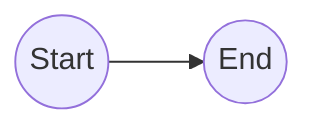

# Mermaid Link Fixture

A diagram whose node links to another document, for the viewer test that follows a link inside a rendered Mermaid diagram.

```mermaid
graph LR
    A((Start)) --> B((End))
    click A "#/md/knowledge/Writing_Style.md" "Writing Style"
```
